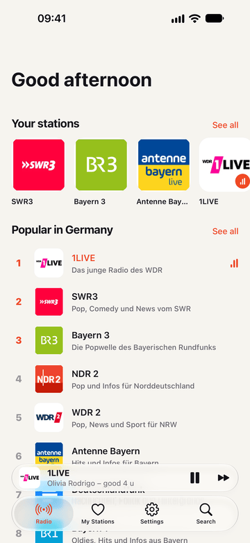
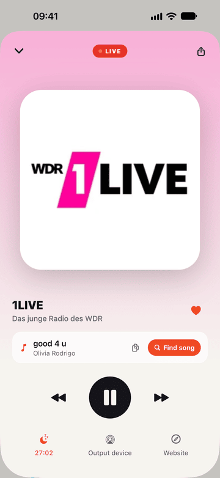
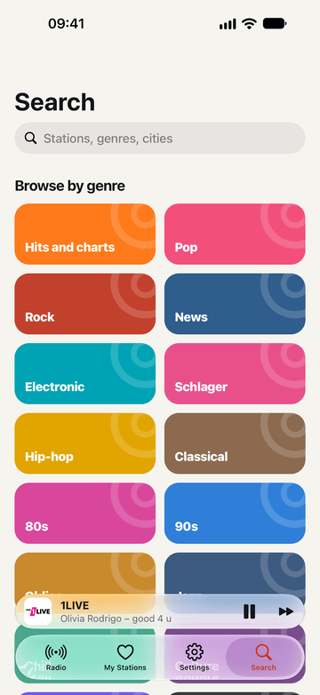
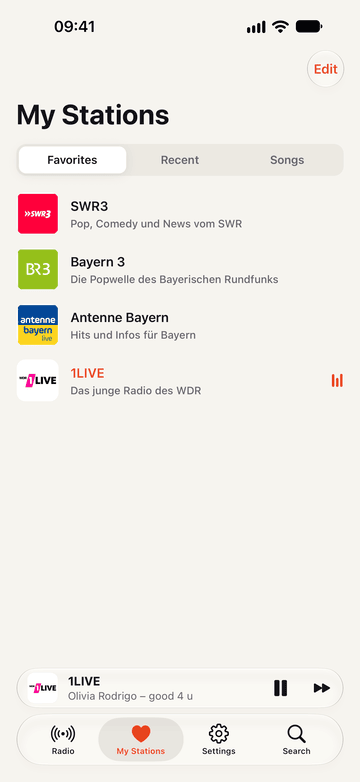

<p align="center">
  
</p>

<h1 align="center">Radiowelle</h1>

<p align="center">
  Free radio for iOS and Android. No ads in the app, no account, no tracking.<br>
  265 German stations built in, tens of thousands more from around the world.
</p>

<p align="center">
  <a href="https://apps.apple.com/app/id6820185211">App Store</a> ·
  <a href="https://play.google.com/store/apps/details?id=de.codext.radiowelle">Google Play</a> ·
  <a href="https://radiowelle.codext.de">Website</a>
</p>

<p align="center">
  
  
  
  
</p>

## Features

- **265 German stations, ready to play.** Every major public and private broadcaster plus local stations from all 16 states, each with a verified stream and logo.
- **The whole world.** Search tens of thousands of stations by name, genre, city or country through the open [radio-browser.info](https://www.radio-browser.info) directory.
- **Live song titles.** Shows what is playing (ICY metadata) and opens the song in Apple Music, Spotify, YouTube Music or Deezer.
- **Made for listening.** Favorites with drag and drop, skip through favorites from the lock screen, headphones and car, a sleep timer that fades out, automatic reconnects, AirPlay.
- **14 languages.** German, English, French, Spanish, Italian, Dutch, Polish, Portuguese, Turkish, Czech, Danish, Swedish, Ukrainian and Russian.
- **Private by design.** Favorites, history and settings stay on the device. No analytics or ad SDKs.

## Tech

- [Expo](https://expo.dev) SDK 57, React Native 0.86 (New Architecture), Expo Router with native tabs
- `modules/radio-player`: a small native module for live radio
  - iOS: `AVPlayer`, lock screen and remote commands, ICY metadata via `AVPlayerItemMetadataOutput`, AirPlay route picker
  - Android: Media3 `ExoPlayer` in a `MediaSessionService` with media notification and ICY metadata
  - Both: reconnect with backoff, stall watchdog, sleep timer with fade-out
- State with [zustand](https://github.com/pmndrs/zustand), persisted in `expo-sqlite` key-value storage; remote data with TanStack Query

```
src/app/              screens (Expo Router)
src/components/       UI building blocks
src/store/            player, library and settings state
src/i18n/             translations
src/data/             bundled station catalog and country names
modules/radio-player/ native audio module (Swift + Kotlin)
scripts/stations/     builds the German station catalog
website/              radiowelle.codext.de (static, Cloudflare)
store/                store listing, screenshots and release tooling
```

## Development

The app uses a native module, so it runs in a development build, not in Expo Go.

```bash
bun install
bunx expo run:ios       # or: bunx expo run:android
```

Typecheck with `bunx tsc --noEmit`.

### Station catalog

`src/data/stations-de.json` and the logos in `assets/logos/de` are generated from a curated list (`scripts/stations/curated.json`) and radio-browser.info. Every stream is checked before it goes in.

```bash
node scripts/stations/build.mjs   # refresh catalog, check streams, normalize logos
node scripts/gen-logos.mjs        # regenerate src/data/logos.generated.ts
```

A station is missing or broken? Open an issue or a pull request against `curated.json`.

### Releases

Store listing texts, screenshot tooling and the App Store Connect / Google Play scripts live in [`store/`](store/README.md).

## License

The source code is released under the [MIT License](LICENSE).

Station names and logos are trademarks of their respective broadcasters and are not covered by this license. They are used only to identify the stations. Broadcasters can ask for changes or removal at kontakt@codext.de. Station data comes from [radio-browser.info](https://www.radio-browser.info).

Made by [Codext GmbH](https://codext.de) in Germany.
